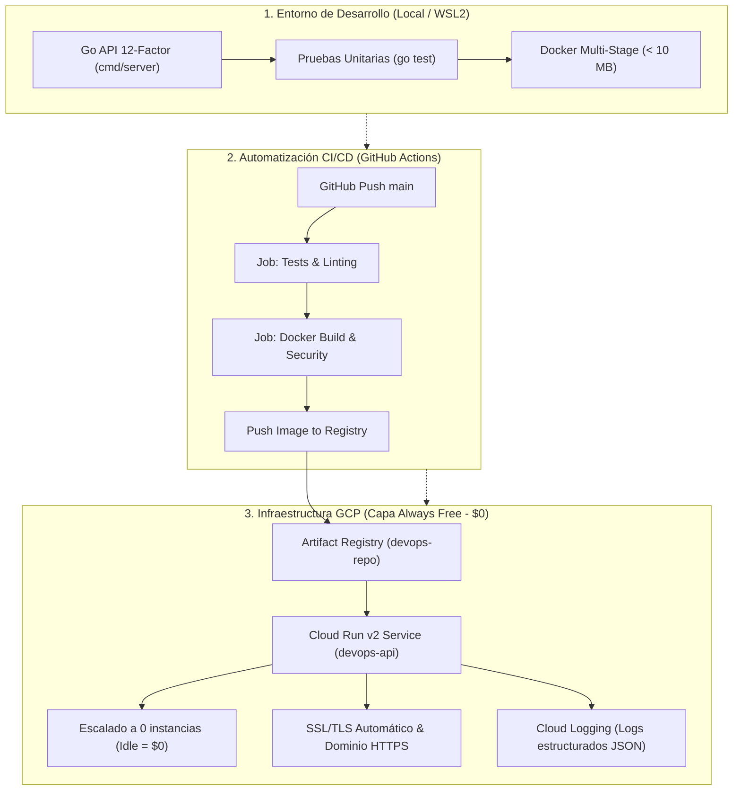

# DevOps Cloud Prototype: Zero to Production (Multi-Cloud Ready)

Prototipo de aplicación nativa de nube (*12-Factor App*) desarrollada en **Go**, contenedorizada con **Docker**, automatizada con **GitHub Actions** y provisionada con **Terraform** en **Google Cloud Platform (GCP)** respetando al 100% la **Capa Gratuita (*Always Free*)**.

---

## 🏛 Arquitectura del Proyecto

---

## 💰 Compromiso FinOps: Capa Gratuita GCP (*Always Free*)

| Recurso | Límite Gratuito Mensual | Configuración en el Proyecto |
| :--- | :--- | :--- |
| **Cloud Run** | 2M de peticiones, 360.000 GB-s | CPU 1, Memoria 128 MiB, `min_instances = 0` (apaga al no haber tráfico) |
| **Artifact Registry** | 0.5 GB de almacenamiento | Imagen ultra-ligera en Alpine (~6.2 MB) |
| **Cloud Logging** | 50 GB de ingesta de logs | Logging estructurado JSON directo a `stdout` |
| **Cloud Build / GitHub Actions** | 2.000 min/mes en GitHub | Pipeline ligero de compilación y despliegue |

---

## 📡 Endpoints de la API

| Método | Endpoint | Descripción | Propósito DevOps |
| :--- | :--- | :--- | :--- |
| `GET` | `/` | Documentación y estado general | Vista preliminar |
| `GET` | `/healthz` | Liveness Probe | El orquestador sabe si el proceso está vivo |
| `GET` | `/readyz` | Readiness Probe | El balanceador sabe cuándo dirigirle tráfico |
| `GET` | `/api/v1/info` | Hostname del contenedor, SO, memoria y uptime | Muestra cómo Cloud Run escala y balancea |
| `GET` | `/api/v1/network` | IP del cliente, cabeceras y proxy inverso | Análisis de proxies, Ingress y balanceadores |
| `GET` | `/metrics` | Telemetría en tiempo real (JSON) | Observabilidad y monitorización |
| `GET` | `/metrics/prometheus` | Formato estándar de Prometheus / OpenMetrics | Integración con Prometheus / Datadog / Grafana |
| `POST` | `/api/v1/chaos/toggle-ready` | Alterna `/readyz` entre 200 y 503 | Pruebas de Chaos Engineering y degradación de servicio |
| `GET` | `/api/v1/chaos/delay?duration=2s` | Simula latencia downstream | Pruebas de timeouts y límites de concurrencia |

---

## 🛠 Comandos Rápidos (`Makefile`)

- **Ejecutar pruebas**: `make test`
- **Compilar binario**: `make build`
- **Construir imagen Docker**: `make docker-build`
- **Probar contenedor local**: `make docker-run`
- **Detener contenedor**: `make docker-stop`
- **Inicializar Terraform**: `make tf-init`
- **Planificar Terraform**: `make tf-plan`
